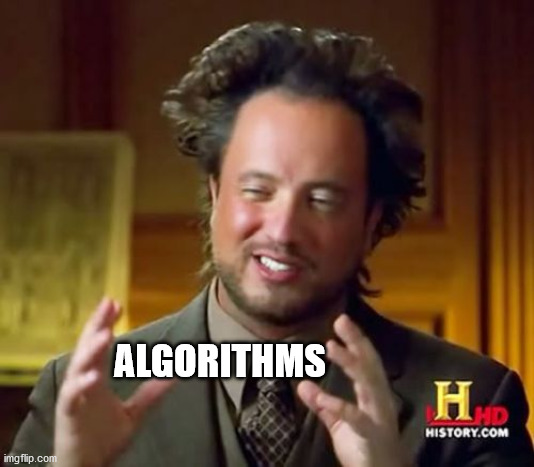

An algorithm is a solution to a problem where the steps to produce the solution are easy to reproduce. 

This folder has a published package, called prm-studio, which shows how solutions can be published and reused inside other Python projects as a dependency. The notebook will walk through some foundational ML algorithms.
