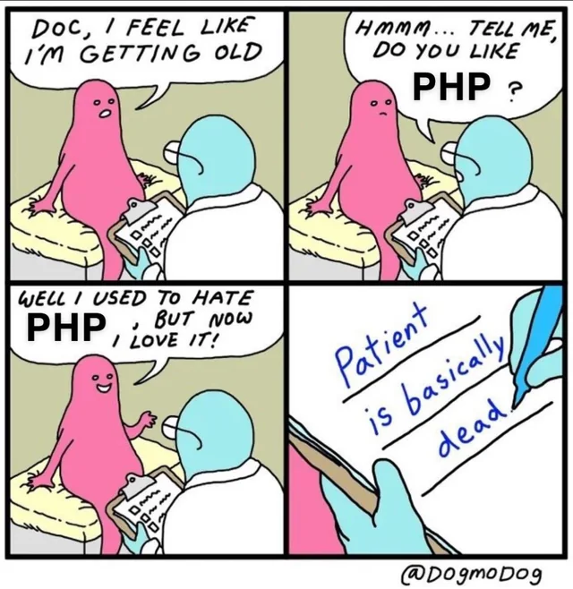

# PHP

PHP (Hypertext Preprocessor) is a server-side scripting language created by Rasmus Lerdorf in 1994 that added dynamic functionality to web pages. It predates JavaScript and is widely used on the internet in interactive and database-driven websites, powering major platforms like WordPress. Facebook was originally written in PHP, but now uses a modified version called "Hack"... which is fitting for the design of the language.



[Install PHP](https://www.php.net/downloads.php?usage=web&os=osx&osvariant=windows-downloads&version=default) on your computer, then you'll be able to run the index file in this folder by running the following command:

```console
uname@os:~$ php -S localhost:8000
```

The contents will be seen at http://localhost:8000 in your browser.
